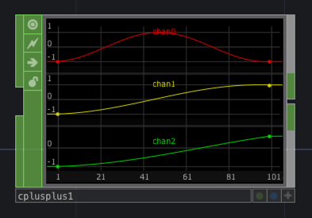

# `td-rs`

Experiments integrating Rust into C++ TouchDesigner plugin, using the wonderful
[cxx-bridge](github.com/dtolnay/cxx-bridge) library. The goal is to be able to
implement TouchDesigner plugins using a safe, pure rust interface, requiring no
additional C++ code, beyond the glue bindings generated by CXX and called by our
wrapper plugin class.

## Structure

```

TouchDesigner --instantiates--> C++ Plugin Class
                                        |
                                        | calls
                                        |
                                        v
                                C++ Wrapper to Bridge
                                        |
                                        | ffi
                                        |
                                        v
                                Rust dyn trait object

```

Using `cxx`, we provide [a codegen ffi interface](./cpp/lib.rs.h) to our Rust
library. Each of our C repr functions exposed by `cxx` accepts [a wrapper](./cpp/BoxDynChop.h) 
around a `std::uintptr_t` pointer that contains the location to our Rust dyn trait object
representing the actual plugin. This wrapper manages calls across the ffi boundary,
and provides a "normal" C++ class interface to the methods exposed by our trait. The [C++
plugin class](./cpp/RustCHOP.cpp) which is ultimately instantiated by TouchDesigner holds 
a reference to this wrapper.

A number of structs are implemented via `cxx` to map TouchDesigner data classes
to structs that can be used by Rust. This currently introduces some performance overhead
at the FFI boundary that could likely be reduced in the future by eliminating copies
in favor of passing references to the underlying structs managed by TouchDesigner.

## Examples

- [`sin_chop`](./src/sin_chop.rs) - A basic CHOP generator that outputs a sin wave on a single channel.
  

## Build

Build currently has only been tested on a Mac. `cxx` outputs a `.a` and header files for our library and common bridge 
structs to Rust's default build directory. We copy these into the [`./cpp`](./cpp) directory and build the project with
Xcode to produce a `.plugin` file that can be used by TouchDesigner. Future work is needed to be able to provide this
project as a crate that could be consumed by other projects without this manual work to bundle our Rust lib into the
C++ project.