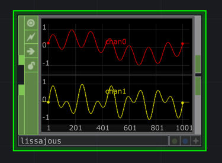

# `td-rs`

Experiments integrating Rust into TouchDesigner using `cxx`.

## Status

This is a work in progress, and is not yet ready for production use. The current
implementation is a proof of concept, and is not yet optimized for performance.
Efforts have been made to ensure that reading and writing data to the operator
buffers is efficient, but the implementation of the `Chop` trait involves a
number of copies and allocations that could be avoided.

Currently, only a limited API of the CHOP plugin type is implemented, with the 
intention of adding support for other plugin types in the future.

## Structure

Using `cxx` we generate a C++ interface or "bridge" to our Rust library, which is then compiled
into a C++ plugin that can be loaded in TouchDesigner. 

The derived C++ plugin is a thin wrapper around a reference to a trait object that implements the
`Chop` trait. The C++ plugin class is responsible for calling the `Chop` trait methods via FFI, and
marshalling the data back and forth between Rust and C++. Additional C++ classes are implemented to 
wrap the TouchDesigner API, and provide a more ergonomic interface to the Rust library using `cxx` Rust types.

## Features

The [`Chop`](./td-rs-chop/src/chop.rs) trait is intended to provide a friendly interface to the TouchDesigner API, and attempts
to follow Rust idioms. Additionally, we provide a derive macro to help automatically register parameters
and update them when they are changed in TouchDesigner. 

## Examples

- [`sin_chop`](./src/sin_chop.rs) - A basic CHOP generator that outputs a sin wave on a single channel.
  
- [`lissa`](./src/lissa.rs) - A fancier version of an LFO that traces a Lissajous curve with
  modifiable parameters.
  

## Build

### `cargo-xtask` (WIP)

Run `cargo xtask build` to build the project. This will build the Rust library and
generate the C++ glue code, and then build the C++ plugin. The resulting plugin
will be placed in `./target/` and can be loaded in TouchDesigner.

```shell
cargo xtask build sin
```

Running the project may require some modification to the respective MSVC and Xcode projects.

### Windows (Currently broken)

#### Dependencies
- MSVC toolchain.
- Rust `x86_64-pc-windows-msvc` target using rustup.

Update the project [Makefile](./Makefile) variable `MS_BUILD` to point to the correct `MSBuild.exe` for
your installed version of Visual Studio, or pass it as a variable to Make. This will produce a DLL to 
`.\Release\` that can be loaded in touch desginer.

### macOS

#### Dependencies
- Xcode (installable from App Store).

 Run make, which will preduce a `.plugin` file in `./build/` that can be loaded in TD. NB: the project
 is configured for M1 ARM, and modifications to the Xcode project are necessary to build for x86.